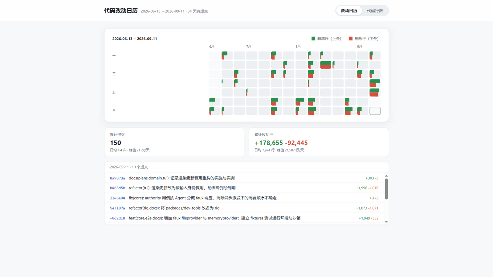
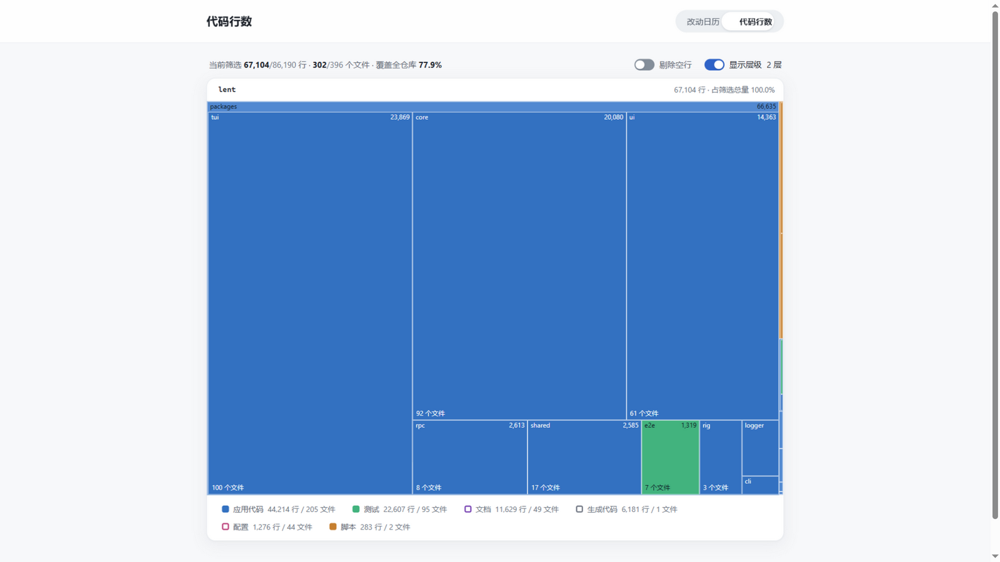

# codelens

把任意 git 仓库的改动历史与代码行数，做成一个本地看板。

[English](./README.en.md) | 简体中文

## 快速开始

```bash
npx @h5l0/codelens                 # 统计当前目录并在浏览器打开
npx @h5l0/codelens ../my-repo      # 统计指定仓库
npx @h5l0/codelens --profile web   # 按前后端拆分改动日历
```

也可以全局安装：

```bash
npm install -g @h5l0/codelens
codelens
```

无需配置。数据在启动时生成，只提供给本机浏览器，不写入被统计的仓库。

## 两个视图

### 改动日历

按周排布的改动热力图：每格是一天，显示当天新增与删除的行数。可以按分组过滤，也可以平移时间窗口看其他周。



### 代码行数

面积树形图：方块面积表示行数，颜色表示分类，深浅表示目录层级。点方块进入该目录，右侧开关控制统计规则与展开层级。



## 命令行参数

```
codelens [目录] [选项]

--profile <名称|文件>  配置档，见下节，内置 all、web
--config <文件>        配置文件，默认 <目录>/codelens.config.json
--days <天数>          日历时间跨度，0 表示全部历史（默认 120）
--exclude <glob>       额外忽略的路径，可重复
--port <端口>          监听端口，默认 5178，被占用时向后尝试
--host <地址>          监听地址，默认 127.0.0.1；监听其他地址时页面对同网段可见
--no-open              不自动打开浏览器
--no-gitignore         不按 .gitignore 过滤，只跳过内置的重目录
--dump <目录>          只写出 data.json 与 loc.json 后退出，不启动服务
--dev                  开发模式，用 Vite 托管前端源码并热更新
-h, --help             显示帮助
-v, --version          显示版本
```

## 配置档

`--profile` 决定切分仓库的维度：

1. 指向 json 文件：`--profile ./my-profile.json`；
2. 取 `codelens.config.json` 里 `profiles` 下的档名，位置可用 `--config` 改：`--profile web`。

内置两档：

| 名称 | 作用 |
| --- | --- |
| `all` | 默认档，不分组，整个仓库一起统计 |
| `web` | `frontend/`、`web/`、`client/`、`ui/` 等算前端，其余算后端 |

### 配置文件格式

```jsonc
{
  "profiles": {
    "modules": {
      "label": "按模块",
      // 改动日历的分组：命中的文件算进该组，按数组顺序取第一个命中的。
      // 最后一个用 ["**"] 兜底，就能得到「A / 其余」这种两分效果。
      "groups": [
        { "id": "core", "label": "核心", "hue": 214, "sat": 58, "match": ["src/core/**"] },
        { "id": "web", "label": "界面", "hue": 152, "sat": 46, "match": ["src/web/**"] },
        { "id": "other", "label": "其他", "hue": 32, "sat": 62, "match": ["**"] }
      ],
      // 行数视图的分类：决定图例与配色，省略 match 的那一项是兜底类。
      "categories": [
        { "id": "core", "label": "核心代码", "hue": 214, "sat": 58, "match": ["src/core/**"] },
        { "id": "test", "label": "测试", "hue": 152, "sat": 46, "defaultOn": false, "match": ["**/*.test.ts"] },
        { "id": "app", "label": "其他代码", "hue": 220, "sat": 20 }
      ],
      // 在 .gitignore 之外额外忽略的路径
      "ignore": ["data/**", "**/*.snap"]
    }
  }
}
```

字段说明：

- `groups[].match`、`categories[].match`、`ignore` 使用仓库相对路径的 glob：`**` 跨目录，`*` 不跨目录，`?` 匹配单个字符，`{a,b}` 择一；不含 `/` 的模式匹配任意层级的同名项，`/foo` 从仓库根起算，`foo/` 表示目录及其全部内容。
- 配置文件允许 `//`、`/* */` 注释与尾随逗号。
- `groups[].id` 不能是保留的 `all`，同一档里不能重复。
- `hue`、`sat` 是 HSL 颜色分量，用于分组色与分类色，缺省为 214、50。
- `categories[].defaultOn` 为 `false` 表示该分类在页面图例里默认关闭；内置分类中「生成代码」「文档」「配置」默认关闭。

不写 `categories` 时使用内置六类：应用代码、测试、脚本、文档、配置、生成代码。

配置里没有的档名回退到内置档：仓库里放一份只定义自定义档的 `codelens.config.json`，`--profile all`、`--profile web` 依然可用。两边都没有的档名才报错。

## 统计规则

- 默认遵守仓库的 `.gitignore`；目录不是 git 仓库时改用等价的忽略规则。`--no-gitignore` 关闭该过滤。
- 始终跳过 `node_modules`、`dist`、`build`、`coverage`、`.venv`、`__pycache__`、`target` 等依赖与构建目录。
- `--exclude` 与配置里的 `ignore` 对两个视图同时生效：被排除的目录既不统计行数，也不计入改动日历。
- 二进制文件、超过 3MB 的文件、空文件不统计；读不出的文件只跳过它，并在启动日志里给出数量。行数为物理行数，文件末尾换行不计一行。
- 改动日历按提交时间（committer date）归入所在天，与 `--days` 的过滤规则一致；改动行数 = 新增 + 删除。
- 合并提交、空提交、只改权限或只动二进制的提交没有行数，但仍出现在提交列表里并计入提交数。
- 对仓库的子目录运行时，两个视图都只统计该子目录，路径也相对它计算。

## 已知限制

- 改动日历依赖 git：没有提交或没有 git 时日历为空，行数视图仍可用。
- 行数只反映文本行数，不反映代码复杂度。
- 树形图一次最多绘制 6000 个方块，超出部分不显示。
- 日历按整周补齐，窗口首尾不足一周时会多画出几天没有数据的格子（底色更白）。

## 多语言

页面语言跟随浏览器，内置简体中文、English、日本語、한국어，其余回落到英文。地址后加 `?lang={langCode}` 可临时覆盖，例如 `?lang=en`。

## 开发

开发环境、项目结构与发布流程见 [DEV.md](./DEV.md)。

## 许可

[MIT](./LICENSE)
