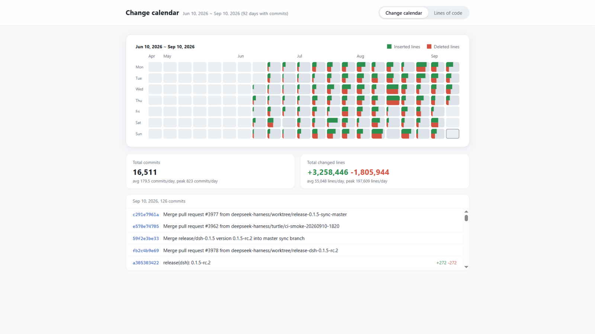
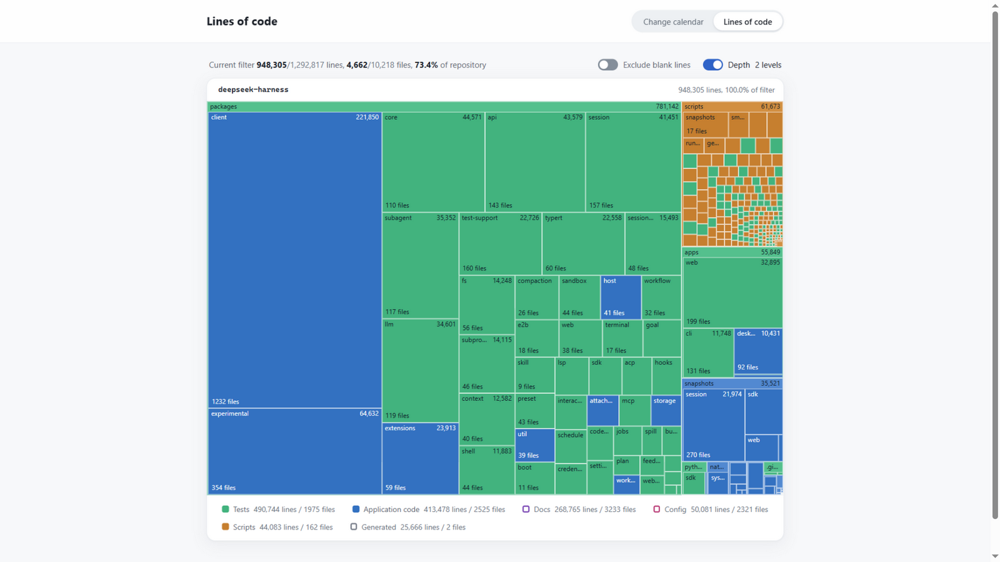

# codelens

[](https://www.npmjs.com/package/@h5l0/codelens)
[](https://github.com/H5L0/codelens/actions/workflows/ci.yml)
[](https://github.com/H5L0/codelens/actions/workflows/publish.yml)

A local dashboard for a git repository: the change history and the lines of code.

English | [简体中文](./README.zh.md)

## Quick start

```bash
npx @h5l0/codelens                 # analyze the current directory and open the browser
npx @h5l0/codelens ../my-repo      # analyze another repository
npx @h5l0/codelens --profile web   # split the calendar into frontend / backend
```

Or install it globally:

```bash
npm install -g @h5l0/codelens
codelens
```

No configuration is needed. codelens collects the data at startup and writes nothing to disk by default.

## The two views

### Change calendar

A weekly heat map of the changes: each cell is one day and shows the lines added and removed. You can filter by group, or move the time window to see other weeks.



### Lines of code

A treemap: each rectangle's area is its line count, its color is the category, and its shade is the directory depth. Click a rectangle to open that directory, or use the switches to set the counting mode and the depth.



## Command line

```
codelens [directory] [options]

--profile <name|file>  Profile, see below. Built in: all, web
--config <file>        Config file, defaults to <directory>/codelens.config.json
--days <days>          Calendar time span, 0 means the full history (default 0)
--exclude <glob>       Extra paths to ignore, repeatable
--port <port>          Listen port, default 5178, tries the next ports when busy
--host <address>       Listen address, default 127.0.0.1. Other addresses expose the page to your network
--no-open              Do not open the browser automatically
--no-gitignore         Do not filter by .gitignore. Only the built-in dependency and build directories are skipped
--dump <dir>           Write data.json and loc.json, then exit without starting a server
--dev                  Dev mode with Vite hot reload
-h, --help             Show help
-v, --version          Show version
```

## Profiles

A profile controls how codelens divides the repository. The calendar colors commits by **group** (`groups`). The treemap colors files by **category** (`categories`).

`--profile` takes a file or a profile name:

```bash
codelens --profile ./my-profile.json   # use this file as the profile
codelens --profile web                 # use the web profile from the config
```

Two profiles come with codelens:

| Name    | Shown in the page as   | What it does                                                                                      |
| ------- | ---------------------- | ------------------------------------------------------------------------------------------------- |
| `all`   | All                    | The default profile. It has no groups and counts the whole repository.                            |
| `web`   | Frontend / backend     | Directories such as `frontend/`, `web/`, `client/` and `ui/` are frontend. The rest is backend.   |

### Config

The config controls the default behavior of codelens and holds a list of profiles. codelens loads `codelens.config.json` from the workspace root by default. Use `--config` to point at another file.

```jsonc
{
  "profiles": [
    {
      "id": "modules",
      "label": "By module",                      // shown in the startup log
      "groups": [                                 // calendar colors, first match wins
        { "id": "core", "label": "Core", "hue": 214, "sat": 58, "match": ["src/core/**"] },
        { "id": "web", "label": "UI", "hue": 152, "sat": 46, "match": ["src/web/**"] },
        { "id": "rest", "label": "Rest", "hue": 32, "sat": 62, "match": ["**"] }
      ],
      "categories": [                             // treemap colors and the legend
        { "id": "core", "label": "Core code", "hue": 214, "sat": 58, "match": ["src/core/**"] },
        { "id": "test", "label": "Tests", "hue": 152, "sat": 46, "defaultOn": false, "match": ["**/*.test.ts"] },
        { "id": "app", "label": "Other code", "hue": 220, "sat": 20 }
      ],
      "ignore": ["data/**", "**/*.snap"]          // extra paths to skip
    },
  ]
}
```

| Field                                           | Meaning                                                                                       |
| ----------------------------------------------- | --------------------------------------------------------------------------------------------- |
| `profiles[*].id`                                | The name of the profile. This is what `--profile` takes. It must be unique in one config.     |
| `profiles[*].label`                             | The name shown in the startup log. Without it, codelens joins the group names.                |
| `profiles[*].{groups/categories}[*].id`         | An identifier. It must be unique in its own list, and it must not be `all`.                   |
| `profiles[*].{groups/categories}[*].label`      | The name shown in the page. Your own text is shown as written.                                |
| `profiles[*].{groups/categories}[*].match`      | Path globs. An item joins the entry it matches. Required for groups, optional for categories. |
| `profiles[*].{groups/categories}[*].hue`, `sat` | The color of the entry, in HSL. The defaults are 214 and 50.                                  |
| `profiles[*].categories[*].defaultOn`           | Set it to `false` and the category is off in the legend at first. Readers can turn it on.     |
| `profiles[*].ignore`                            | Extra paths to skip. It is merged with `--exclude`.                                           |

Notes:

- Glob paths are relative to the repository root. `**` crosses directories. `*` and `?` stay within one segment. `{a,b}` matches either one.
- A pattern without `/` matches that name at any depth. `/foo` counts from the repository root. `foo/` means the directory and everything inside it.
- The config accepts `//` and `/* */` comments and trailing commas.
- Without `categories`, codelens uses six built-in ones. They are application code, tests, scripts, docs, config and generated code. Of these, "docs", "config" and "generated code" are off at first.
- A profile name that the config does not define falls back to a built-in profile. If neither has the name, codelens reports an error.

## Counting rules

- codelens filters by `.gitignore` by default. If the directory is not a git repository, codelens applies equal ignore rules. `--no-gitignore` turns the filter off.
- codelens always skips dependency and build directories such as `node_modules`, `dist`, `build`, `coverage`, `.venv`, `__pycache__` and `target`.
- `--exclude` and the config's `ignore` affect both views. An excluded directory has no line counts and does not appear in the calendar.
- codelens skips binary files, files larger than 3MB and empty files. It skips a file it cannot read and reports the number in the startup log. Line counts are physical lines. The newline at the end of a file does not add a line.
- The calendar puts each commit in the day of its commit time (committer date). `--days` filters by the same time. "Changed lines" means insertions plus deletions.
- Merge commits, empty commits and commits that only change file modes or binaries have no line counts. They still appear in the commit list, and they count as commits.
- When you run codelens on a subdirectory of a repository, both views count that subdirectory only and resolve paths relative to it.

## Known limits

- The change calendar needs git. Without commits or without git, the calendar is empty. The lines view still works.
- The treemap draws at most 6000 rectangles. It does not show the rest.
- Line counts say nothing about code complexity.

## Languages

The page follows the browser language. Simplified Chinese, English, Japanese and Korean are built in. English is the default. Append `?lang={langCode}` to the URL to override the language, for example `?lang=zh` or `?lang=ko`.

## Development

See [DEV.md](./DEV.md) for the development setup, the project layout and the release process.

## License

[MIT](./LICENSE)
